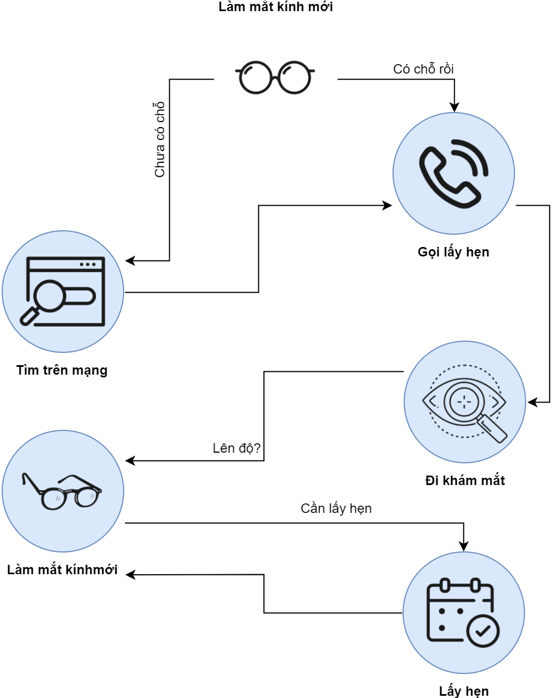

[Bài 2: Ba việc cần làm](README.md)

# 2.4 Mùi vị của sự thành công

## 2.4.1 Hóa chất vui

Khi thắng bộ óc sẽ thải ra hóa chất thần kinh (`HCTK`) [dopamine] làm cho bạn cảm thấy thỏa mãn.

Vì sao hoàn tất 3 việc đơn giản có thể tạo niềm vui?
Khi bạn kết thúc một công viêc, bộ thần kinh sẽ tỏa ra chất _dopamine_ khiến cho cơ thể _thưởng thức_ sự khoái lạc.
Lúc bạn thắng một cuộc đua hoặc được nhận vào công ty mình ao ước, cái cảm giác **đã** là ảnh hưởng của dopamine trong não.

## 2.4.2 `HCTK` không vị nể

Những kết nối thần kinh không phân biệt được bạn đã trúng số, hoặc đã xong cầu nguyện 3 phút.
Khi hoàn tất một việc, bộ não sẽ phát ra hóa chất khoái lạc, _dopamine_.

## 2.4.3 Không phải mọi sự đều tốt

Ngược lại, khi không hoàn tất việc, não bị căn thẳng và thải ra `HCTK` [cortisol] để tăng áp huyết và giảm [serotonin] làm cho buồn và chán (để mình sợ và không dám làm nữa).
Khi thành công, cảm giác khoái lạc chỉ duy trì trong _khoảng thời gian ngắn_; còn khi thất bại, cảm giác nản và thất vọng sẽ _duy trì lâu dài_. 

Bạn cần phải thắng nhiều, thua ít thì mới đạt mức quân bằng.

Nhưng tôi tin rằng bạn sẽ [thành công][1 Cô-rinh-tô 15:57] vì chúng ta có Thần Linh của Chúa. 

*Đưa ra mục tiêu cho ngày mai và hãy thực hiện cho hoàn hảo.*

## 2.4.4 Cách chọn khéo léo

Khi bạn chọn 3 việc, viết xuống càng chi tiết để việc làm nó có khuôn khổ.
Tâm trí của con người thèm trật tự nên khi chọn 3 việc làm nên trả lời những câu hỏi này:

1. Công việc gì?
2. Làm khoảng bao lâu?
3. Ai là đối tượng?
4. Tôi có thể chia ra thành những phần nhỏ hơn để làm được không?

| Thay vì        | Chi tiết hơn: Thêm giờ   | Hay hơn: thêm đối tượng      | Dễ hơn: Chia ra phần nhỏ        |
|--------------- | ------------------------ | ---------------------------- | ------------------------------- |
| Đi nhóm TP     | Đi đến NT trước 5'       | Hỏi thăm bé Tú sau buổi nhóm | Chuẩn bị tiền dâng trước khi đi |
| Đi thăm viếng  | Gọi Trang hỏi giờ tiện   | Rủ Sáu đi thăm Bẩy T5        | Nhắn tin cho Thu lâu không gặp  |
| Suy gẫm Tđ 7   | Dành 12' suy gẫm Tđ 7    | Viết xuống 5 chữ về Tđ 7     | Học thuộc lòng Tđ 7:8           |
| Tập đàn        | Tập bài _Glory_ 15'      | Tập cách để ý Chúa khi đàn   | Đàn bài _Bautiful_ trôi 5x      |
| Cầu nguyện     | CN 5' sau khi thức giậy  | CN cho những giáo viên HT    | CN tiếng lạ 3'                  |
| Chở vợ đi làm  | Thức sớm hơn vợ 1h (5a)  | Vui vẻ, chìu vợ lúc chở đi   | Đổ đầy xăng cho xe vợ tối nay   |

## 2.4.5 Mẫu: Làm mắt kính mới

Khi muốn soạn công việc để thực hiện, ví dụ bạn cần làm đôi mắt kính mới, điều đầu tiên bạn cần làm là đưa ra những câu hỏi cho đến khi không hỏi được nữa.

Sau khi đã vẽ sơ đồ (trong trí) bạn có một _dự án_ cho việc đi làm mắt kiếng như sau:

| Việc cần làm                 |
| ---------------------------- |
| `[ ]` **3 việc hôm nay**     |
|   `[ ]` Tìm VP khám mắt      |
| `[ ]` **Hoãn lại**           |
| `[ ]` _Làm mắt kính_         |
|   `[ ]` Gọi lấy hẹn khám mắt |
|   `[ ]` Đi khám mắt          |
|   `[ ]` Lấy hẹn làm mắt kính |
|   `[ ]` Đi làm mắt kính      |

----

# Thực hiện bài tập `#2.4`

| Mục | Thực hiện / trách nhiệm |
| --- | --- |
| Đọc | Đọc và nghiên cứu phần [2.4.5] |
| Làm | Làm một dự án __Thay lốp xe__ theo mẫu [2.4.5] |
|  | Bạn có `1` ngày để thực hiện và hoàn tất |

[1 Cô-rinh-tô 15:57]: https://twosparro.ws/bible/cadman.1co.15.57
[dopamine]: https://vi.wikipedia.org/wiki/Dopamine
[cortisol]: https://vi.wikipedia.org/wiki/Cortisol
[serotonin]: https://vi.wikipedia.org/wiki/Serotonin

[2.4.5]: section-4.md#245-m%E1%BA%ABu-l%C3%A0m-m%E1%BA%AFt-ki%E1%BA%BFng-m%E1%BB%9Bi
